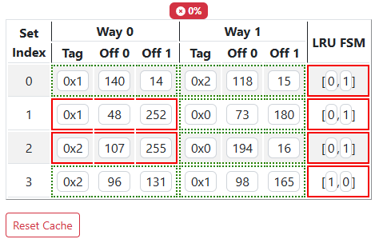
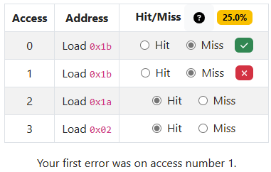

# PrairieLearn OER Element: Cache Table

This element was developed by Geoffrey Herman. Please carefully test the element and understand its features and limitations before deploying it in a course. It is provided as-is and not officially maintained by PrairieLearn, so we can only provide limited support for any issues you encounter!

If you like this element, you can use it in your own PrairieLearn course by copying the contents of the `elements` folder into your own course repository. Note that this repository contains **two** separate elements that are designed to be used in combination, but can also be used independently. The repository also contains a `cache-tables.py` script in the `serverFilesCourse` folder that can be helpful for generating caches to use with the element. The provided example questions illustrate how to use the script.

## `pl-cache-table` element

This element displays a cache table that students can modify. The dimensions of the cache are determined at minimum by the attributes `set-bits` (number of rows), `num-ways` (number of cache blocks per row, and presence of LRU FSMs). Optional attributes such as `block-bits`, `show-data`, `show-valid` can add additional columns. The element has 3 grading modes: `blocks` (default), `cells`, and `all-or-nothing`. The cache comes with a reset button that allows students to reset the cache to the initial problem state.

The initial contents and final contents of the cache must be supplied to the element via `data['params'][answers-name]` and `data['correct_answers'][answers-name]` respectively where `answers-name` is the unique name given to the instance of the element via the HTML tag (i.e., `answers-name` would be `cache` in the example below (e.g., the initial cache state should be stored in `data['params']['cache']`)). A cache configuration must be a list where each element of the list is a dictionary that must contain a `tags` key, but can also have `blocks`, `lru`, and `valid` keys. `tags`, `lru`, and `valid` should be a list of strings, the length of the lists is the same as `num-ways`. `blocks` should be a list of lists, where the outer list has length `num-ways` and the inner lists have length `2**set-bits`. Each inner list should be a list of strings. For example, a 3-way set associative cache with 2B blocks and 4 sets might look like

```python 
data['params']['cache'] = [
    {'tags': ['0x0', '0x1', '0x3'], 'lru': ['0', '1', '2'], 'blocks': [['3', '106'], ['168', '44'], ['75', '64']], 'valid': ['1', '1', '1']}, 
    {'tags': ['0x0', '0x2', '0x3'], 'lru': ['2', '1', '0'], 'blocks': [['38', '141'], ['38', '239'], ['252', '54']], 'valid': ['1', '1', '1']}, 
    {'tags': ['0x2', '0x3', '0x0'], 'lru': ['2', '1', '0'], 'blocks': [['138', '80'], ['114', '107'], ['16', '242']], 'valid': ['1', '1', '1']}, 
    {'tags': ['0x0', '0x2', '0x1'], 'lru': ['0', '1', '2'], 'blocks': [['228', '115'], ['109', '22'], ['173', '190']], 'valid': ['1', '1', '1']}
]
```
### Example



```html
<pl-cache-table 
    answers-name="cache"
    set-bits = "2"
    num-ways = "2"
    block-bits = "1"
></pl-cache-table>
```

### Element Attributes

| Attribute | Type | Description |
|-----------|------|-------------|
| `answers-name` | string (required) | Unique name for the element. |
| `set-bits` | integer (required) | Number of bits used to encode the cache sets. Creates `2**set-bits` sets in the cache |
| `num-ways` | integer (required) | Set associativity of the cache. |
| `block-bits` | integer (default: `1`) | Number of bits used to encode the number of bytes per cache block. Creates `2**block-bits` bytes in each way of the cache. |
| `show-data` | boolean (default: `true`) | If set to `true`, data cells are displayed as a set of columns in each cache block. |
| `show-valid` | boolean (default: `false`) | If set to `true`, valid bits are displayed as a separate column in each block. |
| `show-dirty` | boolean (default: `false`) | If set to `true`, dirty cells are displayed as a set of columns in each cache block. |
| `grade-mode` | string (default: `blocks`) | If set to `blocks`, each cache block is graded as a unit. If one cell of a block is wrong, the whole cell is wrong. Students earn points for correctly updating blocks that changed and lose points for incorrectly updating blocks that should have stayed the same. If set to `cells`, each cell is graded individually. Students earn points for correctly updating each cell that changed and lose points for incorrectly updating cells that should have stayed the same. If set to `all-or-nothing`, students get 0% unless all cells are correct. |
| `display-base` | string (default: `hex`) | Must be `hex` or `bin`. Changes the display format of tag, index, and offset to hex or binary, respectively. |
| `show-partial-score` | boolean (default: `true`) | Shows block-by-block feedback via highlighting in `blocks` or `all-or-nothing` grading mode and cell-by-cell feedback via highlighting in `cells`. |
| `show-percentage-score` | boolean (default: `true`) | Percentage score for the question is displayed as a badge. |
| `read-only` | boolean (default: `false`) | When `false`, the cache is editable and the submitted answer must match the correct answer. When `true`, the cache is not editable and displays cache data stored in `data['params'][answers-name]`. |
| `weight` | integer (default: `1`) | Weight to use when computing a weighted average score over elements. |

The legacy attribute name `is-material` is still accepted as an alias for `read-only`.


## `pl-cache-access-table` element

This element displays a table that lists a series of memory accesses that interact with a cache. Students are expected to determine which memory accesses result in a hit or a miss in the cache. The element expects a correct answer to be stored in `data['correct_answers'][answers-name]`. The dictionary entry should be a list of dictionary entries that include an address stored as a string and a hit/miss flag (`hit`).

```python 
data['correct_answers'][f'{answers_name}'] = [
    {'address': '0x1a', 'hit': False}, 
    {'address': '0x16', 'hit': False}, 
    {'address': '0x1f', 'hit': False}, 
    {'address': '0x1f', 'hit': True}
]
```

The element has 3 grading modes: `through-first` (default), `all`, and `all-or-nothing`. `through-first` is the default grading mode to discourage lazy guessing (i.e., under the `all` grading mode, students can get all answers correct on a second guess without reasoning about the problem).

### Example



```html
<pl-cache-access-table 
    answers-name="{{params.answers_name}}_access" 
></pl-cache-access-table>
```

### Element Attributes

| Attribute | Type | Description |
|-----------|------|-------------|
| `answers-name` | string (required) | Unique name for the element. |
| `grade-mode` | string (default: `through-first`) | If set to `through-first`, grading stops after the first mistake is encountered in the table and all remaining memory accesses are considered to be wrong. Students are not given feedback on later memory accesses. If set to `all`, each row is graded and feedback is available. For `through-first` and `all` the percentage score is the `number of correct rows` / `number of rows`. If set to `all-or-nothing`, each row is graded and feedback is available, but students get 0% unless all rows are correct. |
| `show-partial-score` | boolean (default: `true`) | Shows block-by-block feedback via highlighting in `blocks` or `all-or-nothing` grading mode and cell-by-cell feedback via highlighting in `cells`. |
| `show-percentage-score` | boolean (default: `true`) | Percentage score for the question is displayed as a badge. |
| `empty-cache` | boolean (default: `false`) | All cache blocks start as invalid, first access is a miss. When enabled, the first access is treated as a miss and is displayed without a radio button. |
| `weight` | integer (default: `1`) | Weight to use when computing a weighted average score over elements. |
