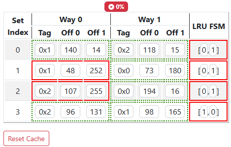

# PrairieLearn OER Element: Cache Table

This element was developed by Geoffrey Herman. Please carefully test the element and understand its features and limitations before deploying it in a course. It is provided as-is and not officially maintained by PrairieLearn, so we can only provide limited support for any issues you encounter!

If you like this element, you can use it in your own PrairieLearn course by copying the contents of the `elements` folder into your own course repository. We also recommend copying the `cache-tables.py` script from `serverFilesCourse` to help you generate caches to use with the element. After syncing, the element can be used as illustrated by the example question that is also contained in this repository.


## `pl-cache-table` element

This element displays a cache table that students can modify. The dimensions of the cache are determined at minimum by the attributes `set-bits` (number of rows), `num-ways` (number of cache blocks per row, and presence of LRU FSMs). Optional attributes such `block-bits`, `show-data`, `show-valid` can add additional columns. The element has 3 grading modes: `blocks` (default), `cells`, and `all-or-nothing`. The cache comes with a reset button that allows students to reset the cache to the initial problem state.

The initial contents and final contents of the cache must be supplied to the element via `data['params'][answers-name]` and `data['correct_answers'][answers-name]` respectively where `answers-name` is the unique name given to the instance of the element via the html tag (i.e., `answers-name` would be `cache` in the example below (e.g., the inital cache state should be stored in `data['params']['cache']`)). A cache configuration must be an list where each element of the list is a dictionary that must contain a `tags` key, but can also have `blocks`, `lru`, and `valid` keys. `tags`, `lru`, and `valid` should be an list of strings, the length of the lists is the same as `num-ways`. `blocks` should be an list of lists, where the outer list has length `num_ways` and the inner lists have length `2**set-bits`. The inner list should be a lists of strings. For example, a 3-way set associative cache with 2B blocks and 4 sets might look like

```python 
data['params']['cache'] = [
    {'tags': ['0x0', '0x1', '0x3'], 'lru': ['0', '1', '2'], 'blocks': [['3', '106'], ['168', '44'], ['75', '64']], 'valid': ['1', '1', '1']}, 
    {'tags': ['0x0', '0x2', '0x3'], 'lru': ['2', '1', '0'], 'blocks': [['38', '141'], ['38', '239'], ['252', '54']], 'valid': ['1', '1', '1']}, 
    {'tags': ['0x2', '0x3', '0x0'], 'lru': ['2', '1', '0'], 'blocks': [['138', '80'], ['114', '107'], ['16', '242']], 'valid': ['1', '1', '1']}, 
    {'tags': ['0x0', '0x2', '0x1'], 'lru': ['0', '1', '2'], 'blocks': [['228', '115'], ['109', '22'], ['173', '190']], 'valid': ['1', '1', '1']}
]
```
### Example



```html
<pl-cache-table 
    answers-name="cache"
    set-bits = "2"
    num-ways = "2"
    block-bits = "1"
></pl-cache-table>
```

### Element Attributes

| Attribute | Type | Description |
|-----------|------|-------------|
| `answers-name` | string (required) | Unique name for the element. |
| `set-bits` | integer (required) | Number of bits used to encode the cache sets. Creates `2**set-bits` sets in the cache |
| `num-ways` | integer (required) | Set associativity of the cache. |
| `block-bits` | integer (default: `1`) | Number of bits used to encode the number of Bytes per cache block. Creates `2**block-bits` Bytes in each way of the cache. |
| `show-data` | boolean (default: `true`) | If set to `true`, data cells are displayed as a set of columns in each cache block. |
| `show-valid` | boolean (default: `false`) | If set to `true`, valid bits are displayed as a separate column in each block. |
| `show-dirty` | boolean (default: `false`) | If set to `true`, dirty cells are displayed as a set of columns in each cache block. |
| `grade-mode` | boolean (default: `blocks`) | If set to `blocks`, each cache block is graded as a unit. If one cell of a block is wrong, the whole cell is wrong. Students earn points for correctly updating blocks that changed and lose points for incorrectly updating blocks that should have stayed the same. If set to 'cells', each cell is graded individually. Students earn points for correctly updating each cell that changed and lose points for incorrectly updating cells that should have stayed the same. If set to `all-or-nothing`, students get 0% unless all cells are correct. |
| `display-base` | string (default: `hex`) | Must be `hex` or `bin`. Changes the display format of tag, index, and offset to be in hex or binary respectively.
| `show-partial-score` | boolean (default: `true`) | Shows block-by-block feedback via highlighting in `blocks` or `all-or-nothing` grading mode and cell-by-cell feedback via highlighting in `cells`. |
| `show-percentage-score` | boolean (default: `true`) | Percentage score for the question is displayed as a badge. |
| `is-material` | boolean (default: `false`) | When false, cache is editable and submitted answer needs to match correct answer. When true, cache is not editable and will display cache data stored in `data['params'][answers-name]`.
| `weight` | integer (default: `1`) | Weight to use when computing a weighted average score over elements. |
